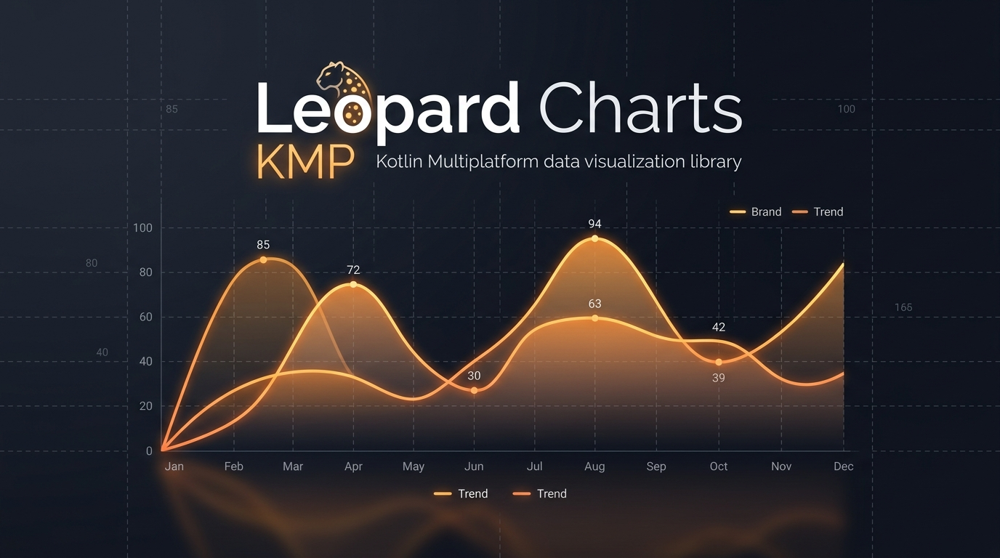

# Leopard Charts

[](https://kotlinlang.org/docs/multiplatform.html)
[](./LICENSE)

A premium, highly interactive, and beautiful data visualization library built entirely with **Compose Multiplatform**. Empower your apps on **iOS, Android, Desktop (JVM), and Web** with sleek, dynamic charts that look stunning out-of-the-box.



> [!NOTE]  
> 📖 **[日本語のREADMEはこちら (Japanese README)](./README_ja.md)**

---

## Key Features

- 📱 **100% Kotlin Multiplatform**: Write once, run everywhere. Designed from the ground up to support iOS, Android, Desktop (macOS/Windows/Linux), and Web targets.
- 🎨 **Premium Aesthetics & Custom Brushes**: Out-of-the-box support for modern dark themes, glowing accents, customizable grid borders, and dynamic coordinate-fitted vertical/radial gradients.
- 📈 **Dense Dataset Horizontal Scrolling**: Avoid compressed or unreadable coordinate points. Choose between scalable grid layouts or sticky Y-axis scrolls with a single parameter toggle (`scrollEnabled`).
- ⚡ **Physics-based Animations**: Bring charts to life with spring bounces, overshoot entries, draw paths, and fluid size transitions utilizing Compose physics.
- 💬 **Interactive Tooltips & Overlays**: Drag and tap coordinates to trigger glowing highlights, bouncy details panels, crosshair guidelines, and stats readouts.

---

## Supported Chart Types

### 1. Line & Area Charts
- Smooth bezier curve interpolation or linear segments.
- Multi-series tracking with custom distinct color palettes.
- **Draw Animation**: Trace lines sequentially from point to point, with synchronized area masking and marker scaling.
- Gradient area fills beneath the line fitting the boundaries.

### 2. Bar Charts
- Side-by-side grouped bars or stacked column layers.
- Dynamic height-fitted vertical linear gradients.
- Customizable corner radiuses, group spacing, and column spacing.

### 3. Bubble & Scatter Charts
- Multi-dimensional data mapping (X, Y, size, labels, and descriptions).
- Elastic spring popovers on coordinate entry.
- Dynamic radial gradient fills centered on coordinates.

### 4. Candlestick & Stock Charts
- Financial OHLC (Open, High, Low, Close) candles with high/low wicks.
- Height-fitted bullish (positive) and bearish (negative) vertical gradients.
- Interactive crosshairs displaying price changes, percentages, and trade dates.

---

## Installation

Add the Leopard repository to your `settings.gradle.kts`:

```kotlin
dependencyResolutionManagement {
    repositories {
        google()
        mavenCentral()
        // Add additional repositories if publishing privately
    }
}
```

Add the dependency to your `commonMain` source set in your Compose Multiplatform project (`build.gradle.kts`):

```kotlin
kotlin {
    sourceSets {
        commonMain.dependencies {
            implementation("io.github.yutarosuzuki-jp:leopard:1.0.0") // Replace with latest version
        }
    }
}
```

---

## Quick Start

### 1. Render a Line Chart

```kotlin
import androidx.compose.ui.graphics.Color
import io.github.leopard.charts.line.LineChart
import io.github.leopard.charts.models.PointData
import io.github.leopard.charts.models.LineSeries

val salesSeries = LineSeries(
    name = "Sales",
    points = listOf(
        PointData(1f, 120f, "Jan"),
        PointData(2f, 180f, "Feb"),
        PointData(3f, 150f, "Mar"),
        PointData(4f, 220f, "Apr")
    ),
    color = Color(0xFF42A5F5),
    fillGradientColors = listOf(Color(0xFF42A5F5), Color(0x0042A5F5))
)

LineChart(
    seriesList = listOf(salesSeries),
    modifier = Modifier.fillMaxWidth().height(300.dp),
    scrollEnabled = true
)
```

### 2. Render a Grouped Bar Chart

```kotlin
import androidx.compose.ui.graphics.Color
import io.github.leopard.charts.bar.BarChart
import io.github.leopard.charts.models.BarData
import io.github.leopard.charts.models.BarGroup

val dataGroups = listOf(
    BarGroup(
        groupLabel = "Q1",
        bars = listOf(
            BarData("Revenue", 150f, listOf(Color(0xFF42A5F5), Color(0xFF1E88E5))),
            BarData("Profit", 80f, listOf(Color(0xFF66BB6A), Color(0xFF43A047)))
        )
    ),
    BarGroup(
        groupLabel = "Q2",
        bars = listOf(
            BarData("Revenue", 220f, listOf(Color(0xFF42A5F5), Color(0xFF1E88E5))),
            BarData("Profit", 120f, listOf(Color(0xFF66BB6A), Color(0xFF43A047)))
        )
    )
)

BarChart(
    groups = dataGroups,
    modifier = Modifier.fillMaxWidth().height(300.dp),
    scrollEnabled = false
)
```

---

## Advanced Customization

Leopard Charts supports deep UI adjustments through configuration classes:

### Grid Configuration (`GridConfig`)
- `showHorizontalLines: Boolean` / `showVerticalLines: Boolean`
- `gridColor: Color`
- `strokeWidth: Dp`
- `dashed: Boolean` (enables solid or dashed lines)
- `ticksCount: Int` (Y-axis grid division limits)

### Animation Configuration (`AnimationConfig`)
- `animateEntry: Boolean`
- `animationSpec: AnimationSpec<Float>` (supports custom springs, cubic-beziers, and standard tweens)
- `durationMillis: Int`

### Tooltip Configuration (`TooltipConfig`)
- `showTooltip: Boolean`
- `backgroundColor: Color`
- `textColor: Color`
- `guideLineColor: Color?`
- `guideLinePathEffect: PathEffect?`

---

## License

This project is licensed under the MIT License - see the [LICENSE](LICENSE) file for details.
